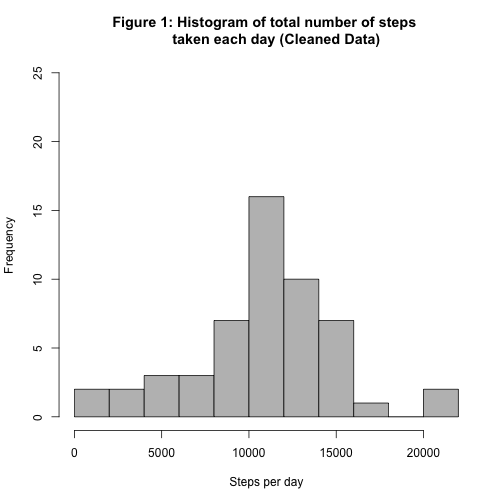
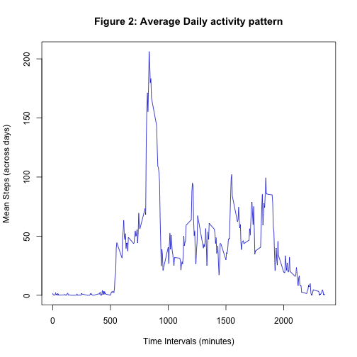
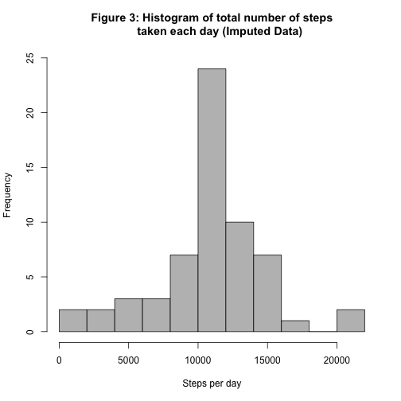
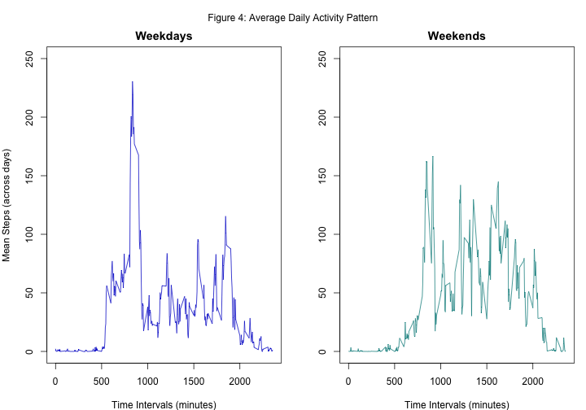

## Source for the Data
Data for this document can be found here: [Activity monitoring dataset](https://d396qusza40orc.cloudfront.net/repdata%2Fdata%2Factivity.zip)  
Alternatively, a zipfile `activity.zip` containing the data is present in the repository itself.  

## Loading and preprocessing the data
Load the data from the csv file. Change the file path to where the data file is 
located.  


```r
filePath <- "../" # change this to to where the data is located on your system
fullPath <- paste("../", "activity.csv", sep = "")
rawData <- read.csv(fullPath, header = TRUE, stringsAsFactors = FALSE)

## convert the date column into the right format
rawData$date <- as.Date(rawData$date) 

## create dataset removing NA values
cleanData <- subset(rawData, is.na(rawData$steps) == FALSE)
```

## What is mean total number of steps taken per day?
First, we calculate the total number of steps taken per day and plot its 
histogram.  


```r
## create vector of steps per day using dates information
options(scipen=999)

## using date as a factor to sum total steps (per day)
stepPerDay <- tapply(X = cleanData$steps,INDEX = cleanData$date, FUN = sum)

## calculating mean and median values
meanSteps <- round(mean(stepPerDay),digits = 2)
medianSteps <- median(stepPerDay)
```

```r
## plot the histogram of total number of steps taken per day
hist(stepPerDay,xlab = "Steps per day", 
     main = "Figure 1: Histogram of total number of steps 
     taken each day (Cleaned Data)", breaks = 10, 
     col = "grey",ylim = c(0,25))
```

 


The data for total number of steps per day has a mean of **10766.19** 
and a median of **10765**.


## What is the average daily activity pattern?
First, we calculate the average number of steps (across all days) taken within a time interval.


```r
## calculating the average steps for each interval (across dates), using steps as
## a factor
meanByInterval <- tapply(cleanData$steps,INDEX = cleanData$interval, FUN = mean)
intervals <- unique(cleanData$interval)
```

```r
## constructing a time series plot to denote the activity (steps) on an 'average' day
plot(x = intervals, y = meanByInterval, type = 'l', 
     xlab = "Time Intervals (minutes)", ylab = "Mean Steps (across days)", main = "Figure 2: Average Daily activity pattern", col = "blue3")
```

 

```r
## calculating the time interval with max average steps
maxStepsInterval <- intervals[which.max(meanByInterval)]
```

The 5-minute interval, on average across all the days in the dataset, that contains the maximum number of steps is the **835th** interval.

## Imputing missing values

The dataset contains several NA values. In order to impute these values, we first calculate the total number of rows with NA values for steps.


```r
naRows <- sum(is.na(rawData$steps))
```

There are **2304 rows** that contain NA values for steps.  
To impute these values, we 

 * Use the **means** for each time `interval` across all dates and  
 * Replace the NA values depending on the time interval they refer too


```r
intervalMeanValues <- as.data.frame(cbind(intervals, meanByInterval))

imputedData <- rawData
for (i in 1:nrow(imputedData)){
    if (is.na(imputedData[i,1]) == T){
        currentInterval <- imputedData[i,3]
        ## Replace NA value with the mean calculated for the interval
        imputedData[i,1]<- intervalMeanValues[intervals == currentInterval, 2]
    }
}
```

```r
## plotting a histogram of the total number of steps taken each day
impstepPerDay <- tapply(X = imputedData$steps,INDEX = imputedData$date, FUN = sum)
impmeanSteps <- round(mean(impstepPerDay),digits = 2)
impmedianSteps <- round(median(impstepPerDay), digits = 2)
## plot the histogram of total number of steps taken per day
hist(impstepPerDay,xlab = "Steps per day", 
     main = "Figure 3: Histogram of total number of steps
     taken each day (Imputed Data)", breaks = 10, 
     col = "grey", ylim = c(0,25))
```

 

Based on the imputed dataset, the histogram for total number of steps per day has a mean of **10766.19** and a median of **10766.19**.

If we compare _Figure 1_ and _Figure 3_, we can see that the overall shape of the histogram has been preserved, with more data being added in _Figure 3_.

### Difference from results obtained while excluding missing values

Comparing the above results with the mean of **10766.19** and median of **10765** obtained with the dataset excluding NA values we see that:

1. **Mean** of total number of steps per day remains the same
2. **Median** of toal number of steps per day is slightly higher for the imputed data than the clean data. It is also not a whole number (as one would expect steps to be) and is equal to the **Mean**

### Understanding the impact of imputing missing data on estimates

This change in the value of the **Median** is primarily because of our choice to impute with the **mean values** for each interval (across dates).  
As a result of **2304** NA values being replaced with the mean value, the _"likelihood of intervals having the mean value"_ has increased. This has caused the median to shift in value towards the mean of the dataset.


## Are there differences in activity patterns between weekdays and weekends?

In order to split our imputed data into weekdays and weekends, we add another variable `weekDay` to our dataset.


```r
## Add new column to data.frame calculating the day of week based on dates
imputedData$weekDay<- weekdays(imputedData$date)

## Replace days with weekday or weekend and converting the variable to a factor
for (i in 1: nrow(imputedData)){
    if (imputedData[i,4] == "Sunday" || imputedData[i,4] == "Saturday"){
        imputedData[i,4] <- "weekend"
    }
    else {
        imputedData[i,4]<- "weekday"
    }
}
imputedData$weekDay <- as.factor(imputedData$weekDay)

## Split the mean data by interval and by weekday/ weekend type
splitByDay <- tapply(imputedData$steps,list(imputedData$interval,imputedData$weekDay),FUN = mean)
splitByDay <- as.data.frame(splitByDay)

## Configure line plot panels to compare activity pattern on weekdays and weekends
par(mfrow = c(1,2), mar = c(4,4,2,1), oma = c(0,0,2,0))

## Setting ylim for easy comparison
plot(x = as.numeric(row.names(splitByDay)),y = splitByDay$weekday,type = "l",
     xlab = "Time Intervals (minutes)", ylab = "Mean Steps (across days)", 
     main = "Weekdays", col = "blue3", ylim = c(0,250))
     
plot(x = as.numeric(row.names(splitByDay)),y = splitByDay$weekend,type = "l",
     xlab = "Time Intervals (minutes)", ylab = "", main = "Weekends", 
     col = "cyan4", ylim = c(0,250))

mtext("Figure 4: Average Daily Activity Pattern",outer = TRUE)
```

 

```r
weekdaySum <- round(sum(splitByDay$weekday))
weekendSum <- round(sum(splitByDay$weekend))
```


On inspecting _Figure 4_, we see that:

1. Overall daily activity has shiften towards the later intervals during weekends as compared to weekdays.
2. Total steps on an Average weekday is approx. 10256 while Total steps on an Average weekend is approx. 12202.


